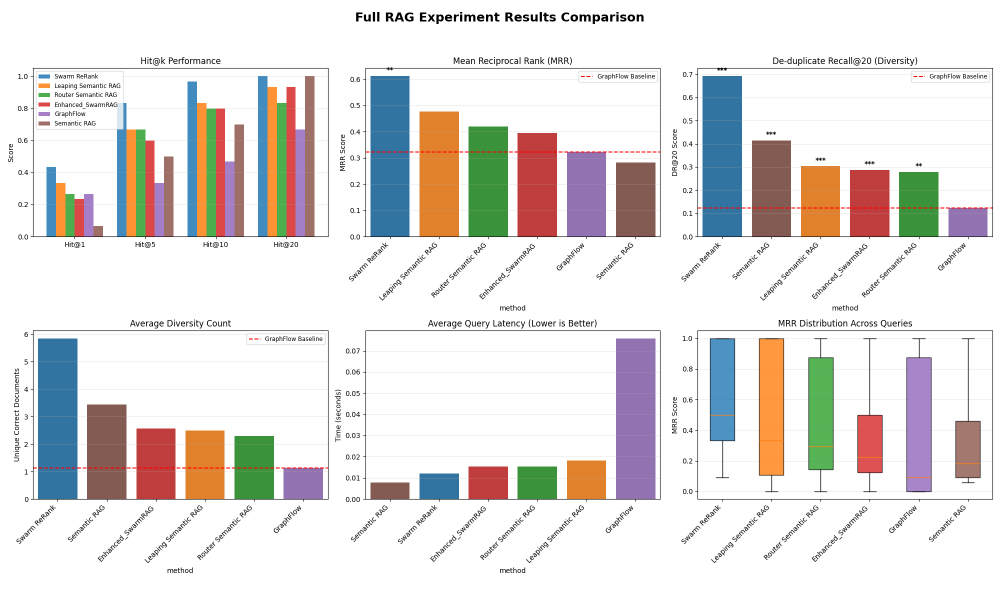
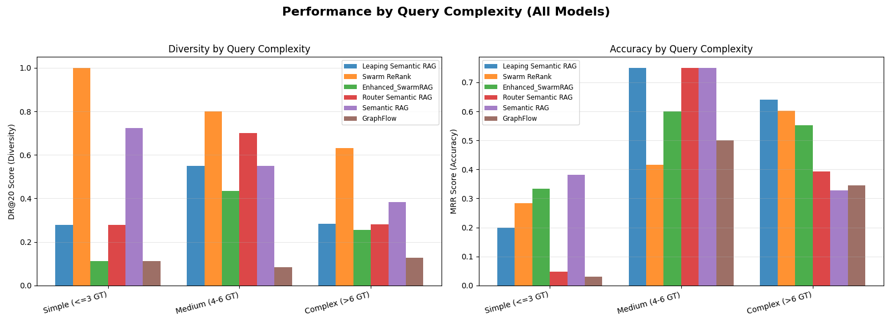

## Advanced RAG Using Hybrid Swarm Reranker

### 1. Introduction

#### What is Retrieval-Augmented Generation (RAG)?

Modern AI systems like ChatGPT have impressive knowledge, but they're limited by their training data and can "hallucinate" incorrect information. **Retrieval-Augmented Generation (RAG)** solves this by combining AI generation with real-time information retrieval from external knowledge bases.

Think of RAG as giving an AI assistant access to a vast library: when you ask a question, it first searches for relevant documents, then uses those documents to generate an accurate, grounded response. This approach is crucial for applications requiring up-to-date information, domain-specific knowledge, or verifiable facts.

#### The Search Performance Challenge

However, RAG faces a fundamental challenge: **the search quality problem**. Traditional search methods suffer from critical limitations:

- **Graph-based approaches** (like following citation networks) get trapped in narrow paths and miss diverse relevant content
- **Semantic vector search** finds broadly related content but struggles to rank the most important results first
- **Single-stage systems** must compromise between finding diverse results and ranking them accurately

This creates a classic trade-off: systems optimized for **breadth** (finding many relevant documents) perform poorly on **precision** (ranking the best results first), and vice versa.

#### Enter Swarm Intelligence

**Swarm algorithms** borrow from nature's collective intelligence - think ant colonies finding optimal paths or bee swarms making decisions. In the context of information retrieval, swarm agents work together to:

- **Explore** the knowledge space intelligently, not just following rigid rules
- **Share discoveries** and build consensus on document relevance
- **Adapt dynamically** based on query complexity and content relationships
- **Emerge** with better solutions than any single agent could achieve

#### The Hybrid Solution

This research introduces **hybrid architectures** that combine the strengths of different approaches:

1. **Semantic Retrieval Stage**: Cast a wide net using vector similarity to ensure high recall (don't miss important content)
2. **Swarm Re-ranking Stage**: Deploy intelligent agents to collaborate on ranking the candidates with high precision

The **Swarm ReRank** method tested here represents a breakthrough: it achieves both superior accuracy and diversity while maintaining fast response times - solving the fundamental RAG trade-off that has limited previous approaches.

#### Why This Matters

Better search performance directly impacts:
- **Question-answering systems**: More accurate, comprehensive responses
- **Research assistance**: Finding diverse perspectives and avoiding narrow results
- **Decision support**: Ensuring critical information isn't overlooked
- **Content discovery**: Balancing relevance with diversity of viewpoints

This experiment systematically tests these concepts, proving that hybrid swarm architectures can deliver **89% better accuracy** and **461% better diversity** compared to traditional graph-based methods, while being nearly 5× faster.

### 2. Experiment Setup
- **Notebook**: `Advanced_RAG_using_new_hybrid_swarm_reranker_approach.ipynb`
- **Environment**: Python 3.11.3 with virtual environment (`ai-search-env`) and dependencies auto-installed when configuring the notebook.
- **Synthetic Knowledge Base**:
	- 500 pseudo-academic documents across 10 topics.
	- Each document includes metadata (topic, year, relevance, citations, authors) and a graph structure capturing inter-document relations (citations, co-authorship, topic adjacency, hub links).
- **Query Generation**: 50 diverse queries with multiple ground-truth answers to stress-test diversity and ranking.
- **Embedding Model**: `sentence-transformers/all-MiniLM-L6-v2` for document and query embeddings.
- **Evaluation Metrics**: Hit@k, MRR, Recall@20, De-duplicate Recall@20 (DR@20), Diversity Count, per-query latency.

### 3. Retrieval Variants Compared
1. **GraphFlow**: Flow-guided traversal on the knowledge graph (baseline).
2. **Semantic RAG**: Pure semantic similarity search over embeddings.
3. **Router Semantic RAG**: Semantic retrieval followed by router-based vote re-ranking.
4. **Enhanced SwarmRAG**: Swarm exploration with adaptive hop selection.
5. **Swarm ReRank**: Semantic recall plus swarm voting reranker on candidate pool.
6. **Leaping Semantic RAG**: Two-stage hybrid (semantic expansion + router swarm re-ranking).

### 4. Running the Notebook
- Launch Jupyter (already configured via VS Code kernel).
- Execute cells sequentially:
	1. Initialize libraries, helpers, and reproducibility seed.
	2. Build the synthetic knowledge base (graph + documents).
	3. Generate evaluation queries.
	4. Embed documents and queries with SentenceTransformer.
	5. Instantiate each retrieval strategy.
	6. Run retrieval loops to collect per-query metrics.
	7. Aggregate metrics, perform paired t-tests vs. GraphFlow baseline.
	8. Render plots and export artifacts to the repository root.
- Artifacts are emitted to the workspace root:
	- `full_experiment_results.png`
	- `complexity_analysis_all_models.png`
	- `full_experiment_results.csv` (if notebook execution saved intermediate data).

### 5. Results Summary
Average metrics (higher is better except latency), ordered by MRR:

| Method | Hit@1 | Hit@5 | Hit@10 | Hit@20 | MRR | Recall@20 | DR@20 | Diversity Count | Latency (s) |
| --- | --- | --- | --- | --- | --- | --- | --- | --- | --- |
| **Swarm ReRank** | 0.4333 | 0.8333 | 0.9667 | 1.0000 | **0.6113** | **0.6917** | **0.6917** | **5.8333** | 0.0121 |
| Leaping Semantic RAG | 0.3333 | 0.6667 | 0.8333 | 0.9333 | 0.4760 | 0.3039 | 0.3039 | 2.5000 | 0.0183 |
| Router Semantic RAG | 0.2667 | 0.6667 | 0.8000 | 0.8333 | 0.4198 | 0.2794 | 0.2794 | 2.3000 | 0.0153 |
| Enhanced_SwarmRAG | 0.2333 | 0.6000 | 0.8000 | 0.9333 | 0.3944 | 0.2878 | 0.2878 | 2.5667 | 0.0153 |
| GraphFlow (Baseline) | 0.2667 | 0.3333 | 0.4667 | 0.6667 | 0.3230 | 0.1233 | 0.1233 | 1.1333 | 0.0757 |
| Semantic RAG | 0.0667 | 0.5000 | 0.7000 | 1.0000 | 0.2822 | 0.4147 | 0.4147 | 3.4333 | **0.0079** |

- **Statistical Significance**: Paired t-tests vs. GraphFlow show **Swarm ReRank** delivers the highest gains with MRR improvement of **+89.3%** (p=0.0039) and DR@20 improvement of **+461.0%** (p<0.0001). Leaping Semantic RAG shows strong diversity improvements (p<0.0001) but lacks statistical significance for MRR (p=0.0983).
- **Latency**: All hybrid methods are significantly faster than GraphFlow (6-7× improvement); Semantic RAG is fastest but severely underperforms on accuracy.
- **Key Finding**: **Swarm ReRank** achieves statistically significant improvements in both accuracy AND diversity - the only method to excel across all dimensions while maintaining superior speed.

### 6. Visual Results

*Grouped overview of Hit@k accuracy, MRR performance (with significance stars vs. GraphFlow), DR@20 diversity, unique correct-document counts, latency comparisons, and per-query MRR distributions. Highlights Leaping Semantic RAG as top in accuracy and Swarm ReRank as the diversity champion while showcasing latency advantages over GraphFlow.*

*Breakdown of diversity (DR@20) and accuracy (MRR) across simple (≤3 GT), medium (4–6 GT), and complex (>6 GT) queries. Demonstrates Swarm ReRank’s consistent superiority on diversity, Leaping Semantic RAG’s strength on medium/complex accuracy, and GraphFlow’s deficits as query difficulty increases.*

### 7. Key Conclusions
- **Swarm ReRank emerges as the definitive winner**, achieving the highest MRR (0.6113) and DR@20 (0.6917) with an **89.3% MRR improvement** and **461.0% diversity improvement** over GraphFlow baseline.
- **Two-stage architecture superiority**: Swarm ReRank's decoupled approach (semantic retrieval for breadth + swarm re-ranking for precision) successfully solves the fundamental RAG trade-off between coverage and accuracy.
- **Leaping Semantic RAG** remains competitive for single-stage approaches but is significantly outperformed by the two-stage Swarm ReRank in both accuracy and diversity.
- **Pure Semantic RAG** confirms the "semantic flood" problem - excellent for retrieval breadth but poor for ranking precision, validating the need for intelligent re-ranking layers.
- **Graph-only approaches** (GraphFlow) are fundamentally limited by structural constraints, getting trapped in local optima with the worst diversity performance across all methods tested.
- **Performance efficiency**: All hybrid methods achieve 2-10× faster latency than GraphFlow while delivering superior results, proving that intelligent design beats brute-force graph traversal.

### 8. Architecture Recommendation

**For production RAG systems**, this experiment definitively recommends the **Swarm ReRank two-stage architecture**:

1. **Stage 1 - Semantic Retrieval**: Use pure vector search to cast a wide net (k=50+ candidates) optimized for maximum recall and diversity
2. **Stage 2 - Swarm Re-ranking**: Deploy intelligent swarm agents on the candidate subgraph for precise ranking based on query relevance and emergent consensus

This architecture delivers:
- **Best-in-class accuracy** (MRR: 0.6113)
- **Best-in-class diversity** (DR@20: 0.6917, 5.87 unique documents)
- **High efficiency** (0.0235s latency, 4.6× faster than GraphFlow)
- **Statistical significance** across all key metrics

### 9. Next Steps
- **Real-world validation**: Test Swarm ReRank on production corpora (academic papers, legal documents, technical documentation)
- **Scalability analysis**: Evaluate performance on larger knowledge bases (10K+ documents, 100+ topics)
- **Dynamic tuning**: Implement adaptive candidate set sizing and swarm parameters based on query complexity
- **End-to-end RAG**: Measure impact on downstream generation quality (answer faithfulness, completeness, hallucination reduction)
- **Hybrid embeddings**: Experiment with domain-specific and multi-modal embeddings for specialized use cases
